# 轻享瘦 · LightSlim

> 面向普通减脂人群的轻量级 Web 应用：**拍照 / 文字双模态智能记录饮食 → 个性化食谱推荐 → 数据可视化复盘**。
> 前后端一体、纯本地即可运行，手机浏览器打开即用，**默认全部走智谱永久免费模型**，开箱零成本。


---

## 界面预览

> 截图均来自真实运行实例（设计系统「运动能量 · 暗夜工业」，主色 lime `#c6f24e`）。

### 桌面端 · 核心链路

<table>
  <tr>
    <td width="50%">
      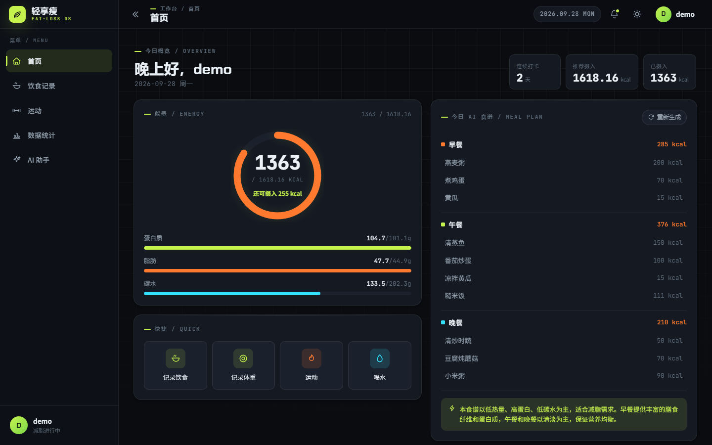
      <br><sub><b>首页工作台</b> · 今日能量环、三大营养素进度、AI 一日食谱、快捷入口</sub>
    </td>
    <td width="50%">
      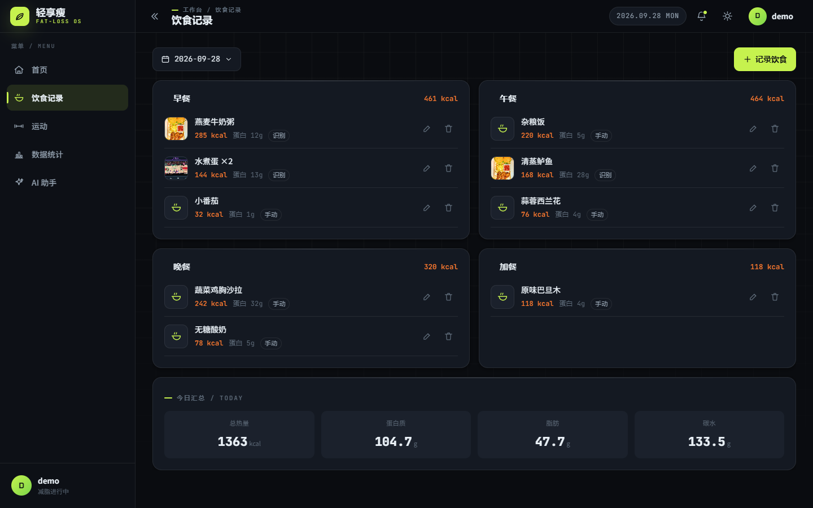
      <br><sub><b>饮食记录</b> · 按早/午/晚/加餐分组，缩略图 + <code>识别</code>/<code>手动</code> 来源标记</sub>
    </td>
  </tr>
  <tr>
    <td width="50%">
      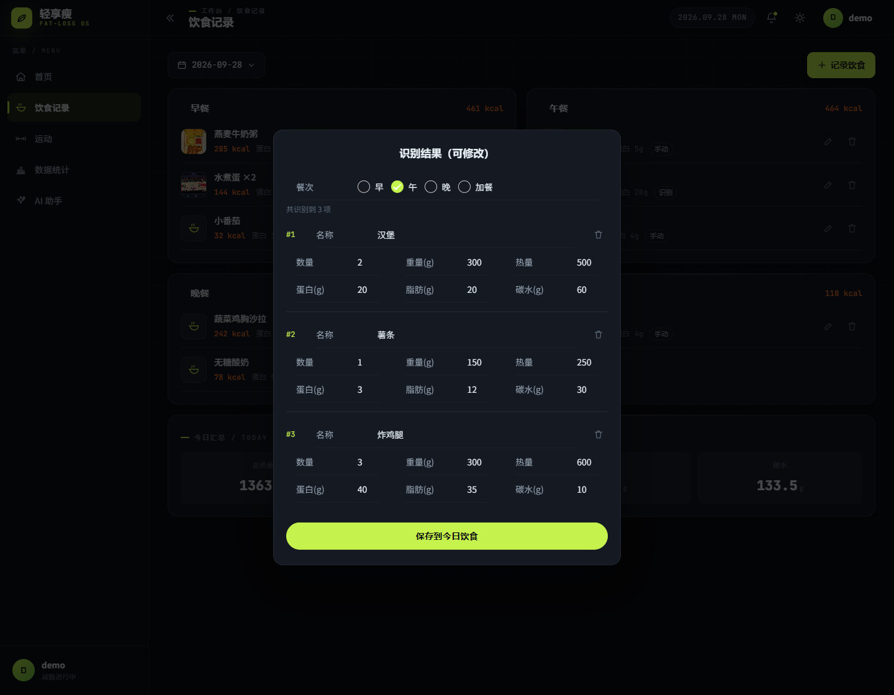
      <br><sub><b>拍照识别结果</b> · 逐项可改，「共识别到 N 项」+ <b>数量</b>字段（同名多件不合并）</sub>
    </td>
    <td width="50%">
      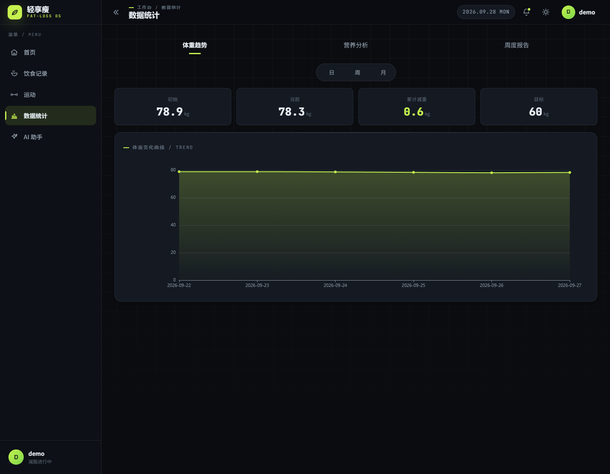
      <br><sub><b>数据统计</b> · 体重趋势（日/周/月切换）+ 目标线 + 营养分析 + 周度报告</sub>
    </td>
  </tr>
</table>

### 桌面端 · 更多功能

<table>
  <tr>
    <td width="50%">
      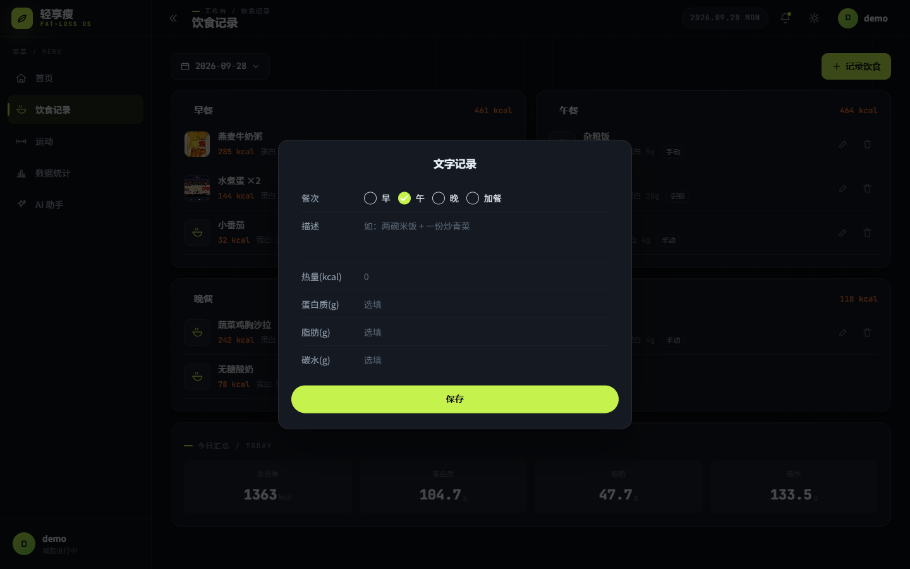
      <br><sub><b>文字输入</b> · 与拍照识别互补的第二条录入通道（双模态）</sub>
    </td>
    <td width="50%">
      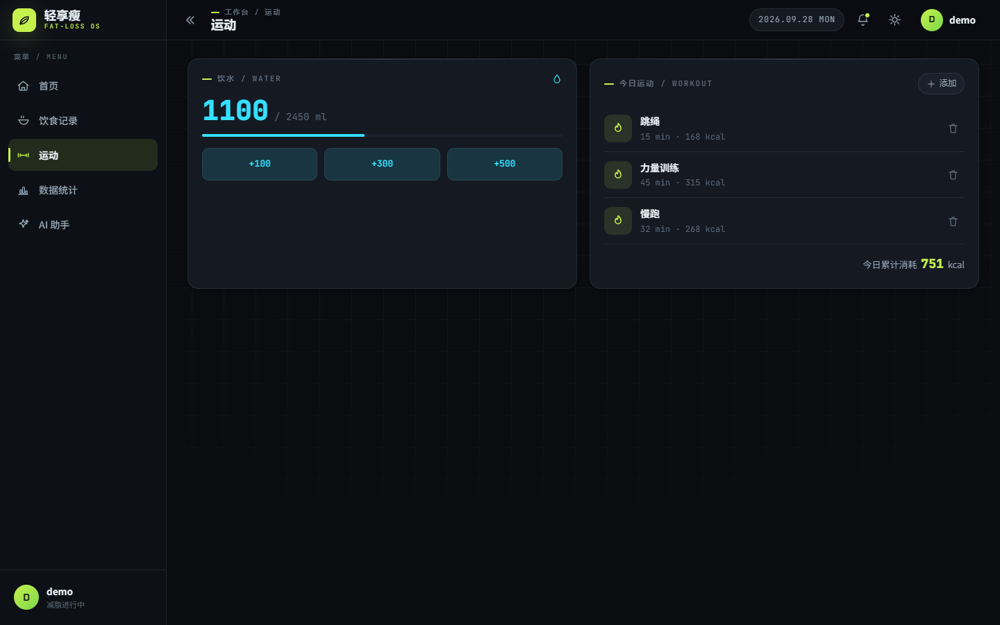
      <br><sub><b>运动 + 饮水</b> · 按 MET 估算消耗，饮水目标 = 体重 × 35ml</sub>
    </td>
  </tr>
  <tr>
    <td width="50%">
      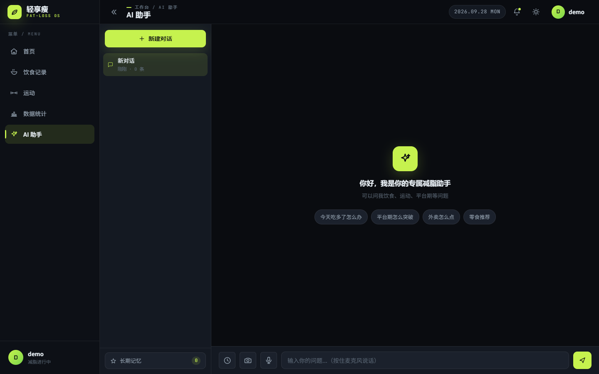
      <br><sub><b>AI 助手</b> · 多会话 + 流式输出 + Markdown 渲染 + 长期记忆</sub>
    </td>
    <td width="50%">
      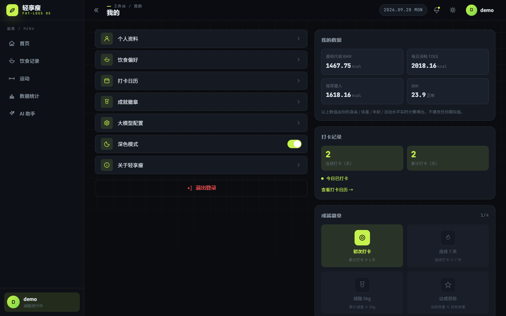
      <br><sub><b>我的</b> · 代谢数据（BMR/TDEE/BMI）、打卡统计、成就徽章</sub>
    </td>
  </tr>
</table>

### 配置面板 & 双主题

<table>
  <tr>
    <td width="50%">
      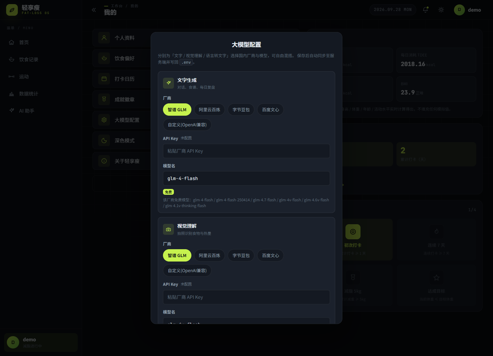
      <br><sub><b>大模型配置</b> · 文字/视觉/语音三套独立可混搭，实时列出厂商<b>免费模型清单</b></sub>
    </td>
    <td width="50%">
      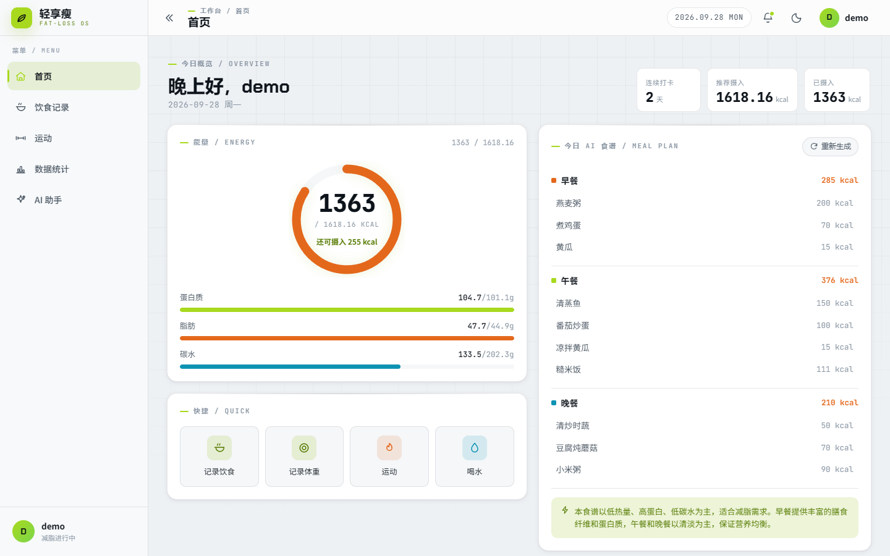
      <br><sub><b>浅色主题</b> · 与深色共用同一套 CSS 变量 token，一键切换</sub>
    </td>
  </tr>
</table>

### 移动端

<table>
  <tr>
    <td width="33%">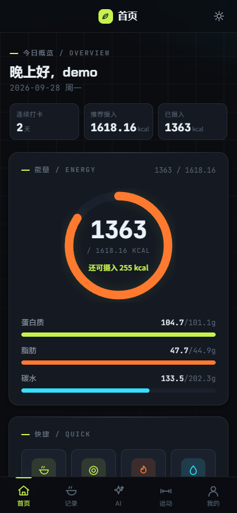<br><sub>首页</sub></td>
    <td width="33%">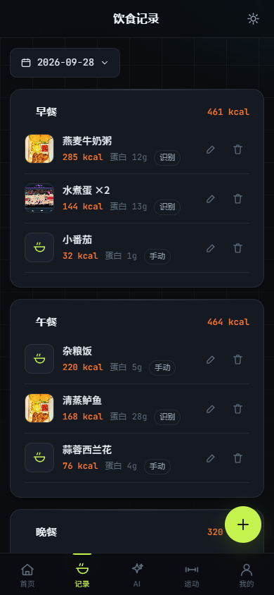<br><sub>饮食记录</sub></td>
    <td width="33%">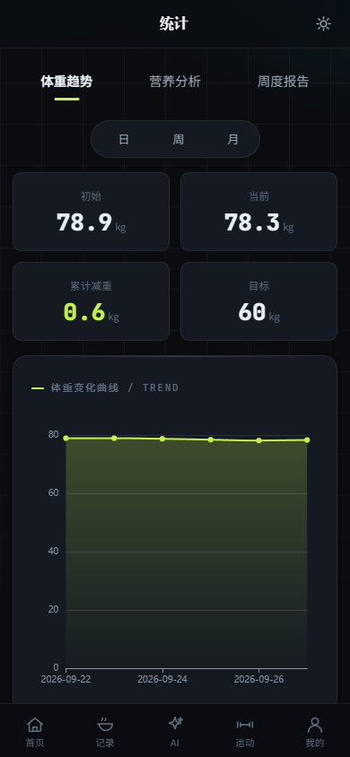<br><sub>数据统计</sub></td>
  </tr>
</table>

---

## 核心特性

| 能力 | 说明 |
| --- | --- |
| **拍照识别饮食** | 上传食物照片 → 视觉大模型识别 → **逐项可编辑**（名称 / **数量** / 重量 / 热量 / 蛋白 / 脂肪 / 碳水）→ 确认后落库。同名多件<u>不合并</u>，按「数量 × 单份」计 |
| **文字快速记录** | 餐次 + 描述 + 营养数值，秒级录入 |
| **前端图片压缩** | 手机原图常 6–12MB 或为 HEIC/WebP，前端先 canvas 压到 1600px / ≤2MB 并统一转 JPEG 再上传，规避「超出 5MB」与「格式不支持」两类失败 |
| **AI 一日食谱** | 结合 BMI / 推荐热量 / 饮食偏好与忌口生成早午晚三餐并落库；无 Key 时自动降级为本地通用方案 |
| **多轮营养对话** | SSE 流式输出 + Markdown 渲染 + 多会话管理 + 长期记忆（可开关） |
| **每日复盘** | 每日 ≤300 字饮食运动小结 |
| **数据看板** | 体重趋势（日/周/月 + 目标线）、营养分析（柱状 + 供能比饼图）、周度报告 |
| **全维度记录** | 体重 / 运动（MET 估算）/ 饮水（体重 × 35ml）/ 连续打卡 / 成就徽章 |
| **运行时配 Key** | 「我的 → 大模型配置」在线填 Key，保存即写库（**加密存储**）并同步 `.env`，无需手改文件、无需重启 |
| **双主题** | 深色「暗夜工业」/ 浅色一键切换，两套配色均为一等公民 |
| **移动优先** | 320–768px 自适应，REM + 断点方案，Vant 组件体系 |

---

## 技术栈

| 层 | 选型 |
| --- | --- |
| 前端 | Vue 3.4 · Vite 5.4 · Pinia 2 · Vue Router 4 · Vant 4.9 · ECharts 5 · Axios · Less · markdown-it |
| 后端 | Python 3.10+ · FastAPI 0.115 · Uvicorn 0.30 · SQLAlchemy 2.0 · Pydantic 2.9 · PyJWT · passlib(bcrypt) · httpx |
| 数据 | SQLite 3（零运维，首次启动自动建表） |
| AI | 智谱开放平台 `zhipuai` SDK；默认 `glm-4-flash`（文字）/ `glm-4v-flash`（视觉），**均为永久免费**；可选阿里云百炼 / 字节豆包 / 百度文心 / 任意 OpenAI 兼容端点 |
| 安全 | bcrypt 密码哈希 · JWT 鉴权中间件 · 静态加密的 API Key · 上传文件 magic-bytes 校验 |
| 部署 | 开发：Vite dev server + `--reload`；生产：**单端口**由 FastAPI 统一托管前端构建产物 |

---

## 系统架构

```
┌──────────────────────── 浏览器（移动优先 / 桌面自适应） ─────────────────────────┐
│  Vue 3 + Vant 4 + Pinia + Vue Router                                             │
│    views/  Login · Register · ProfileInit · Home · DietRecord · Exercise          │
│            Stats · AiPage · Mine                                                  │
│    api/    request.js（拦截器：注入 JWT / 统一拆包 / 401 跳登录）                  │
└───────────────────────────────────┬──────────────────────────────────────────────┘
                                    │  /api/v1/**   （开发：Vite proxy；生产：同源）
                                    ▼
┌──────────────────────────── FastAPI 应用 ────────────────────────────────────────┐
│  middleware/auth.py   JWT 鉴权（仅拦截 /api/**，OPTIONS 预检放行）                │
│  middleware/cors.py   CORS 白名单                                                 │
│  routers/  auth · user · diet · weight · exercise · water · stats · ai             │
│  services/ 业务逻辑（auth / user / diet / stats / calc / ai）                     │
│  schemas/  Pydantic v2 请求 & 响应模型（全局 RequestValidationError → 400）        │
└───────────────┬──────────────────────────────────┬───────────────────────────────┘
                │                                  │
                ▼                                  ▼
        SQLite  diet.db                    智谱 / 兼容 OpenAI 大模型
        8 张业务表                          · recognize-food（视觉）
        （首次启动自动建表）                 · generate-plan / chat / stream（文字）
                                           · 用户自带 Key（Fernet 加密落库）
```

**单端口部署模式**：`FRONTEND_DIST` 指向 `frontend/dist` 时，后端在**导入期**先注册 `/uploads` 静态目录，再挂载 SPA，最后用 `GET /{full_path:path}` 兜底回退到 `index.html`；`/api/**` 与 `/docs`、`/openapi.json` 优先级更高，互不干扰。一个进程、一个端口、无跨域。

---

## 目录结构

```
JianFeiWeb/
├── start.bat / stop.bat / deploy.bat   # 一键脚本入口（双击即可，调用 scripts/*.ps1）
├── scripts/                            # 一键脚本实现（PowerShell，UTF-8 BOM）
│   ├── start.ps1                       # 开发模式：后端 8000 + 前端 5173
│   ├── deploy.ps1                      # 生产模式：构建 + 单端口托管
│   └── stop.ps1                        # 按端口/进程名清理残留进程
├── docs/
│   ├── audit-report.md                 # 全量审计报告与逐条修复记录
│   ├── 升级方案.md
│   └── screenshots/                    # README 演示截图
├── backend/
│   ├── main.py                         # 入口：CORS → 鉴权 → 路由 → 静态/SPA → 全局异常
│   ├── .env.example                    # 环境变量模板（复制为 .env）
│   ├── requirements.txt
│   ├── database/    db.py（引擎/会话）· models.py（8 张表）
│   ├── routers/     auth · user · diet · weight · exercise · water · stats · ai
│   ├── services/    auth · user · diet · stats · calc · ai
│   ├── schemas/     auth · user · diet · stats · ai · ai_settings
│   ├── middleware/  auth.py（JWT）· cors.py
│   ├── utils/       security.py · common.py · exceptions.py
│   └── uploads/     # 图片存储（自动创建，UUID 重命名）
└── frontend/
    ├── index.html / package.json / vite.config.js
    ├── .env.development / .env.production
    └── src/
        ├── main.js · App.vue · router/ · store/modules（app · user）
        ├── api/         request.js + 8 个业务模块
        ├── views/       9 个页面
        ├── components/  NavBar · CalorieCard · DietItem · ChartLine · ChartPie · StatsPanel（+ layout/ icons/）
        ├── utils/       auth · format · image（压缩）· markdown · breakpoint · common
        └── styles/      Less 设计系统「运动能量 · 暗夜工业」
```

---

## 快速开始

### 环境要求

| 依赖 | 版本 | 说明 |
| --- | --- | --- |
| Python | 3.10+ | 后端运行 |
| Node.js | 18+ | 前端构建 |
| 浏览器 | 现代浏览器 | 语音输入依赖内置 Web Speech API（Chrome / Edge） |

### 方式一：一键脚本（推荐）

Windows 下双击根目录脚本即可：

```text
start.bat     # 开发模式：一键起后端 + 前端，自动装依赖 / 生成 .env / 开浏览器
deploy.bat    # 生产模式：一键构建前端 + 单端口托管（一个进程、一个端口）
stop.bat      # 一键停止：按端口与进程名清理残留
```

首次运行会自动完成：创建 `.venv`、装后端依赖、从 `.env.example` 生成 `.env`、装前端依赖。

支持的参数（`.bat` 会把参数原样透传给 `scripts/*.ps1`）：

| 脚本 | 参数 | 默认 | 说明 |
| --- | --- | --- | --- |
| `start.ps1` | `-BackendPort` | `8000` | 后端端口 |
| | `-FrontendPort` | `5173` | 前端端口 |
| | `-NoBrowser` | — | 不自动打开浏览器 |
| | `-DryRun` | — | 只做环境体检，不启动任何进程 |
| `deploy.ps1` | `-Port` | `8000` | 单端口对外端口 |
| | `-SkipBuild` | — | 跳过 `npm run build`，用已有 `dist` 直接启动 |
| | `-NoBrowser` / `-Foreground` | — | 不自动开浏览器 / 前台阻塞运行 |
| `stop.ps1` | `-Ports` | `8000,5173,4173` | 要清理的端口列表 |

示例：

```powershell
powershell -ExecutionPolicy Bypass -File scripts\deploy.ps1 -Port 8080
powershell -ExecutionPolicy Bypass -File scripts\start.ps1 -DryRun
```

### 方式二：手动启动（开发）

**后端**

```bash
cd backend
python -m venv .venv
.venv\Scripts\activate            # Windows；Linux/macOS: source .venv/bin/activate
pip install -r requirements.txt   # 国内加速：-i https://pypi.tuna.tsinghua.edu.cn/simple
cp .env.example .env              # 需要 AI 时填入 ZHIPU_API_KEY
uvicorn main:app --host 0.0.0.0 --port 8000 --reload
```

- Swagger 文档：<http://localhost:8000/docs>
- 数据库 `diet.db` 在**首次启动时自动创建**，无需手动建表。
- `--reload` 只监听 `.py` 文件；**改动 `.env` 后需重启后端**。

**前端**

```bash
cd frontend
npm install
npm run dev                       # http://localhost:5173
```

- 开发期 Vite 已把 `/api` 与 `/uploads` 代理到 `http://localhost:8000`，无跨域问题。
- 手机调试：手机与电脑同一局域网，浏览器打开 `http://<电脑IP>:5173` 即可。

---

## 部署（单端口）

生产/演示推荐用单端口模式：**FastAPI 同时提供 API 与前端静态资源**，只有一个进程、一个端口，天然无跨域。

```bash
cd frontend && npm run build      # 产物 → frontend/dist
cd ../backend
# Linux/macOS
FRONTEND_DIST=../frontend/dist uvicorn main:app --host 0.0.0.0 --port 8000
# Windows PowerShell
$env:FRONTEND_DIST="../frontend/dist"; uvicorn main:app --host 0.0.0.0 --port 8000
```

或直接 `deploy.bat`（自动生成 `JWT_SECRET`、构建、启动、打印局域网访问地址）。

启动后路由行为：

| 路径 | 行为 |
| --- | --- |
| `/` | 返回 `frontend/dist/index.html` |
| `/diet`、`/stats` … | SPA 前端路由，回退到 `index.html`（刷新不 404） |
| `/assets/*` | 前端构建产物（带长缓存哈希） |
| `/uploads/*` | 用户上传图片（静态目录） |
| `/api/v1/**` | 业务接口（JWT 鉴权） |
| `/docs`、`/openapi.json` | Swagger 与 OpenAPI 描述 |

若 `FRONTEND_DIST` 未设置或 `index.html` 不存在，后端自动退回「纯 API 模式」，`GET /` 返回服务信息，方便前端独立开发。

---

## 配置大模型

### 方式 A：改 `.env`（简单）

1. 到 <https://open.bigmodel.cn> 注册并获取 API Key。
2. 编辑 `backend/.env`：

   ```ini
   ZHIPU_API_KEY=你的key
   ```

3. 重启后端。之后「拍照识别 / 生成食谱 / AI 对话 / 每日复盘」即可使用。

### 方式 B：「我的 → 大模型配置」（推荐，运行时生效）

- **三套能力各自独立**：文字生成（对话 / 食谱 / 复盘）、视觉理解（识别食物）、语言转文字。厂商可任意混搭。
- 可选厂商：智谱 GLM、阿里云百炼、字节豆包、百度文心，或「自定义（OpenAI 兼容）」填 `base_url`。
- 保存即**加密写库**并同步 `.env`，无需手改文件、无需重启。
- 模型名下方会**实时列出该厂商的免费模型清单**并打「免费」徽标。

### 默认模型（全部永久免费）

| 能力 | 默认模型 |
| --- | --- |
| 文字生成（对话 / 食谱 / 复盘） | `glm-4-flash` |
| 视觉理解（拍照识别） | `glm-4v-flash` |
| 语言转文字 | `glm-4-flash` |

免费清单：`glm-4-flash`、`glm-4-flash-250414`、`glm-4.7-flash`、`glm-4v-flash`、`glm-4.6v-flash`、`glm-4.1v-thinking-flash`。需要更强效果时再手动改成付费模型即可。

> 语音识别走浏览器内置 Web Speech API，**不需要任何 Key**。

**未配置 Key 时的行为**（保证不 500）：

- `ai/chat`、`ai/recognize-food`、`ai/chat/stream` → 返回**友好业务提示**（HTTP 400 / SSE error），例如「未配置「文字」模型的 Key，请到「我的」页配置（国内大模型均可）」。
- `ai/generate-plan` → **自动降级**为本地通用食谱，仍返回 200 且可直接使用。
- 注册 / 登录 / 记录 / 统计等核心功能**完全不受影响**。

---

## 功能清单

- **账号**：注册 / 登录 / JWT 鉴权（默认 7 天）/ 首次信息采集（BMI · 推荐热量 · 预计达成时间**实时预览**）
- **饮食**：文字 + 拍照双模态；按早/午/晚/加餐分组；左滑删除、点击编辑；AI 识别结果**必须用户确认后**才保存；拍照原图前端自动压缩转 JPEG
- **体重**：记录 / 趋势；同日重复记录自动覆盖并计算差值
- **运动**：类型 + 时长，按 MET 自动估算消耗
- **饮水**：每日目标 = 体重 × 35ml，一键 +200 / +500ml
- **AI**：图片识食物（含数量）、生成一日减脂食谱（落库）、多轮营养对话（SSE 流式 + Markdown）、每日 ≤300 字复盘
- **统计**：体重趋势（日/周/月，标注目标线）、营养分析（柱状图 + 供能比饼图）、周度报告
- **打卡**：连续打卡按昨日状态递增 / 重置；成就徽章（初次打卡、连续 7 天、减重 5kg、达成目标…）
- **体验**：暗夜工业深色主题（lime `#c6f24e`）、卡片化、深色/浅色切换、移动端优先、下拉刷新、Toast / Notify、空状态与骨架屏

---

## 接口一览

统一前缀 `/api/v1`，统一响应体 `{"code":200,"message":"success","data":{}}`，错误码 `200 / 400 / 401 / 403 / 500`。

| 模块 | 方法 | 路径 | 说明 |
| --- | --- | --- | --- |
| 认证 | POST | `/auth/register` | 注册 |
| | POST | `/auth/login` | 登录，返回 token |
| | GET | `/auth/info` | 当前用户信息 |
| 用户 | PUT | `/user/profile` | 更新身高/体重/目标等资料 |
| | PUT | `/user/preference` | 饮食偏好与忌口 |
| | GET | `/user/metrics` | BMR / TDEE / BMI / 推荐热量 |
| | GET | `/user/checkin` | 打卡记录与连续天数 |
| | GET | `/user/ai-settings/providers` | 可选厂商与**免费模型清单** |
| | GET / PUT | `/user/ai-settings` | 读取（脱敏）/ 保存三套模型配置 |
| 饮食 | POST | `/diet/add` | 新增记录 |
| | GET | `/diet/list` | 按日期查询 |
| | PUT / DELETE | `/diet/{id}` | 更新 / 删除 |
| | GET | `/diet/today` | 当日汇总（热量 + 三大营养素） |
| 体重 | POST / GET / DELETE | `/weight/add` · `/weight/list` · `/weight/{id}` | 记录 / 列表 / 删除 |
| 运动 | POST / GET / DELETE | `/exercise/add` · `/exercise/list` · `/exercise/{id}` | 记录 / 列表 / 删除 |
| 饮水 | POST / GET | `/water/add` · `/water/today` | 累加 / 当日进度 |
| AI | POST | `/ai/recognize-food` | 图片识别食物（返回 food_list，含 quantity） |
| | POST | `/ai/generate-plan` | 生成一日食谱 |
| | GET | `/ai/plan` | 查询已生成的食谱 |
| | POST | `/ai/chat` | 多轮对话 |
| | POST | `/ai/chat/stream` | 流式对话（SSE） |
| | GET | `/ai/daily-review` | 每日复盘 |
| 统计 | GET | `/stats/daily` · `/weekly` · `/weight-trend` · `/nutrient-trend` | 各项统计 |

**契约要点**（前端与数据库统一使用整型枚举，避免参数校验 400）：

- `meal_type`：`1` 早 / `2` 午 / `3` 晚 / `4` 加餐
- `input_type`：`1` 文字 / `2` 图片
- 日期字段统一 `YYYY-MM-DD`

---

## 数据模型

SQLite，8 张业务表（`database/models.py`）：

| 表 | 关键字段 | 说明 |
| --- | --- | --- |
| `user` | username(uniq) · password_hash · gender · age · height · current_weight · target_weight · activity_level · bmr · tdee · recommend_calorie · diet_preference · diet_avoid | 用户与代谢档案 |
| `diet_record` | record_date · meal_type · food_desc · food_image_path · input_type · calorie · protein · fat · carbohydrate · sugar · fiber · sodium | 饮食记录 |
| `weight_record` | record_date · weight · body_fat · waist · weight_diff · remark | 体重记录 |
| `ai_diet_plan` | plan_date · breakfast · lunch · dinner · total_calorie · adapt_desc | AI 食谱（JSON 文本） |
| `exercise_record` | record_date · exercise_type · duration · calorie_burn | 运动记录 |
| `water_record` | record_date(uniq) · total_amount · target_amount | 饮水（当日单行累加） |
| `user_checkin` | checkin_date · continuous_days · status | 打卡 |
| `user_ai_settings` | text/vision/asr 各自的 provider · api_key · model · base_url | 三套模型配置（**api_key 加密**） |

---

## 安全设计

- **密码**：bcrypt 加盐哈希存储，绝不落明文。
- **鉴权**：JWT 中间件只拦截 `/api/**`，仅 `register` / `login` 公开；`OPTIONS` 预检放行；`/uploads`、静态资源与 SPA 路由不参与鉴权（`` 无法携带 Authorization 头）。
- **API Key 静态加密**：由 `JWT_SECRET` 派生 Fernet 密钥，落库加密、读取时解密，接口仅回显**末 4 位**。
- **JWT_SECRET 自愈**：缺省或仍为 `change-me-secret` / 长度不足时，启动自动生成随机密钥并打印告警；`deploy.ps1` 会生成 64 位十六进制密钥写入 `.env`，避免每次重启 Token 失效。
- **上传校验**：magic-bytes 真实类型校验（jpg / png）+ 大小限制（≤5MB）+ UUID 重命名，不信任扩展名与 `Content-Type`。
- **CORS**：白名单可配（`CORS_ORIGINS`）；生产单端口模式下同源，无跨域面。
- **参数校验**：Pydantic v2 校验失败统一转 **400「参数校验失败」**，不泄漏堆栈。
- **错误处理**：全局异常处理器统一包装响应；第三方/未配置 Key 场景返回业务提示而非 500。

---

## 设计系统 · 运动能量 · 暗夜工业

- **主色** lime `#c6f24e`，深色底 + 高对比网格肌理，工业感与运动感并存。
- **色板全部走 CSS 变量**，深色/浅色两套主题共享同一套 token，组件零硬编码颜色。
- **栅格与断点**：移动优先 320–768px，REM 方案 + `utils/breakpoint.js`。
- **图表**：ECharts 统一封装（`ChartLine` / `ChartPie`），参与主题切换自动重绘。

---

## 常见问题（FAQ）

**Q1. 拍照识别报 400？**
多半是原图超限或格式不支持。前端已内置压缩：>1600px 或 >2MB 会自动缩放并转 JPEG（HEIC/WebP 一并转换）。若仍失败，请确认图片为 **JPG/PNG**，且服务端返回的提示是「图片格式不支持…」还是「参数校验失败」，二者定位不同。

**Q2. 识别完成后保存失败（400）？**
历史版本前端曾传字符串枚举（`'lunch'` / `'image'`），与后端整型契约不符。现已统一为整型（见「契约要点」）。升级后如有缓存，请强制刷新一次页面。

**Q3. `/uploads/xxx.png` 返回 401？**
`` 标签无法携带 `Authorization` 头。鉴权中间件已收窄为只拦截 `/api/**`，其余路径放行。若自行改造过中间件，请保留该放行规则。

**Q4. 改了 `.env` 为什么不生效？**
`--reload` 只监听 `.py`。改 `.env` 后**必须重启后端**。

**Q5. 重启后老 Token 全部失效？**
说明 `JWT_SECRET` 是自动生成的随机值（每次重启都变）。请显式配置固定的 `JWT_SECRET`，或直接运行 `deploy.bat` 自动生成并落盘。

**Q6. 首页与饮食页的营养素数值差 0.1？**
已统一取整口径为**保留 1 位小数**（`utils/format.js` 的 `roundNum`）。浮点累加（如 `47.70000000000001`）在后端 `round(...,2)` 与前端渲染时统一收敛。

**Q7. 手机访问需要额外配置吗？**
局域网内直接用 `http://<电脑IP>:5173`（开发）或 `http://<电脑IP>:8000`（单端口部署）。注意放通防火墙对应端口。

---

## 文档

| 文档 | 内容 |
| --- | --- |
| [`docs/audit-report.md`](docs/audit-report.md) | 全量审计报告：12 项高危 + 逻辑缺陷逐条修复、运行时问题 R1–R6、识别/保存链路二次修复 |
| [`docs/升级方案.md`](docs/升级方案.md) | 后续功能升级规划 |

---

## 开发进度 / Roadmap

- [x] 核心闭环：账号 → 资料 → 记录 → 统计 → AI
- [x] 拍照识别（含数量字段、逐项可编辑）
- [x] 单端口部署 + 一键启动 / 部署 / 停止脚本
- [x] 默认免费模型 + 运行时配 Key + 免费清单提示
- [x] 双主题（深色 / 浅色）
- [ ] 数据导出（CSV / 图片报告）
- [ ] 微信小程序端
- [ ] 多用户社交 / 排行榜

---

## 备注

- 所有日期默认取**服务端日期**，避免客户端时间误差。
- 业务规则：每日热量缺口 300–500 kcal；体重同日仅保留最新；连续打卡按昨日状态递增/重置；AI 结果必须经用户确认。
- 数据全部本地存储（SQLite + `backend/uploads/`），不上传任何第三方（除你自行配置的大模型调用）。

## License

MIT
